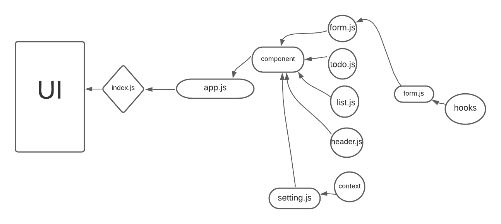

# todo-app

* one way of using global states in React by using context API. that done by creating, providing, wrapping, and consumming the context.

* useForm is a custom hook that contains a function that will be called when you click on the submit button, and will handle onSumbit and onchange functions.

## Netlify

https://bespoke-starship-5ddbaf.netlify.app/

## UML

